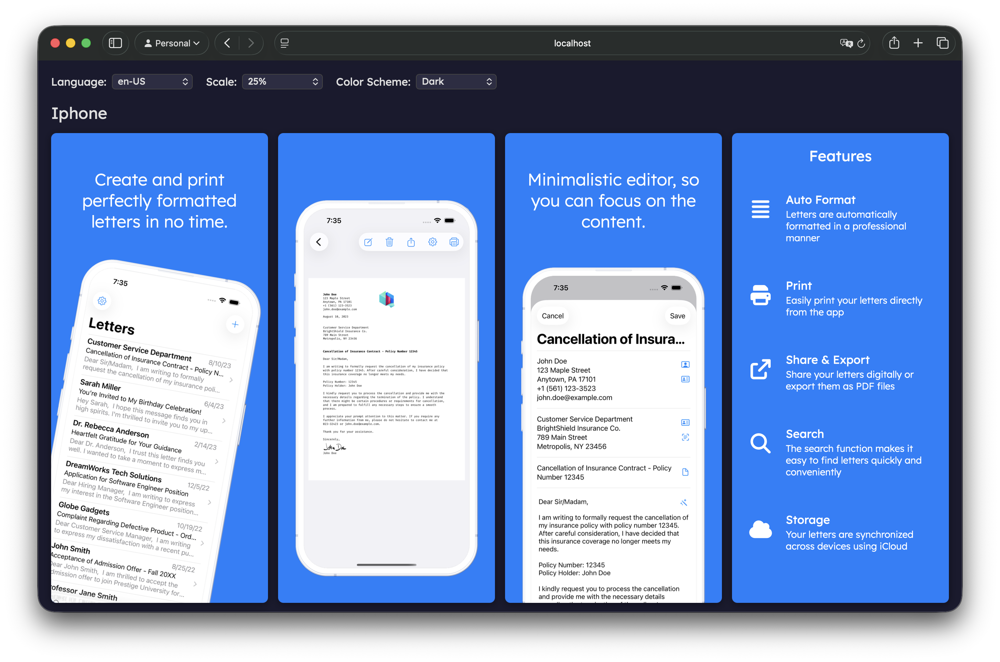

# screegen

A screenshot generation toolkit for creating App Store screenshots. Build beautiful, localized screenshots for multiple devices with React and Playwright.



## Packages

| Package | Description |
|---------|-------------|
| [@screegen/components](./packages/components) | Reusable React components for building screenshot layouts |
| [@screegen/cli](./packages/cli) | CLI tool for scaffolding projects and generating screenshots |

## Quick Start

### Create a new project

```bash
npx @screegen/cli init -n my-app
cd my-app
yarn install
```

### Development

```bash
yarn dev
```

### Generate screenshots

```bash
yarn generate
```

## Features

- **Multi-device support**: Generate screenshots for iPhone, iPad, Mac, and more
- **Multi-language**: Built-in support for localized screenshots
- **Dark mode**: Light and dark color scheme support
- **Playwright-powered**: Fast, reliable screenshot generation
- **React-based**: Use familiar React patterns to build screenshot layouts
- **Fastlane compatible**: Output naming compatible with fastlane deliver

## Project Structure

```
screegen/
├── packages/
│   ├── components/     # @screegen/components - React component library
│   │   ├── src/
│   │   │   ├── types/          # TypeScript type definitions
│   │   │   ├── hooks/          # React hooks (useColorScheme, useUrlState)
│   │   │   └── components/     # Screen, FeatureList, OverviewGrid, etc.
│   │   └── package.json
│   │
│   └── cli/            # @screegen/cli - Command line tool
│       ├── src/
│       │   ├── commands/       # init, generate commands
│       │   └── templates/      # Project scaffolding templates
│       └── package.json
│
└── package.json        # Root workspace config
```

## Development

This is a yarn workspaces monorepo.

```bash
# Install dependencies
yarn install

# Build all packages
yarn build

# Run tests
yarn test
```

## Configuration

Create a `screegen.config.ts` file:

```typescript
import { ProjectConfig } from '@screegen/components';
import OverviewScreen from './src/screens/Overview';
import FeaturesScreen from './src/screens/Features';

const config: ProjectConfig = {
  languages: ['en-US', 'de-DE'],
  devices: [
    {
      key: 'iphone',
      fastlaneKeys: ['APP_IPHONE_67'],
      width: 1290,
      height: 2796,
      screens: [
        { key: 'overview', component: OverviewScreen },
        { key: 'features', component: FeaturesScreen },
      ],
    },
  ],
};

export default config;
```

## License

MIT
