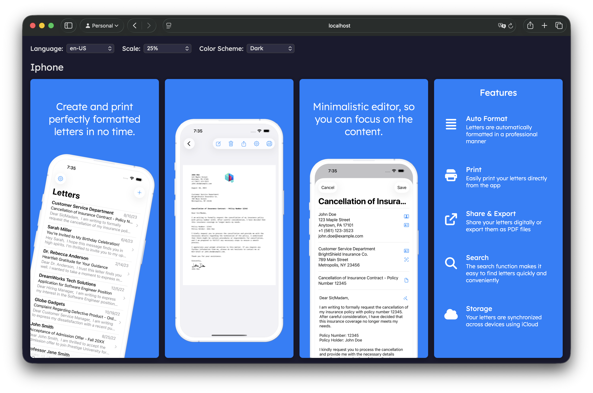

# screegen

A screenshot generation toolkit for creating App Store screenshots. Build beautiful, localized screenshots for multiple devices with React and Playwright.



## Packages

| Package                                       | Description                                                  |
| --------------------------------------------- | ------------------------------------------------------------ |
| [@screegen/components](./packages/components) | Reusable React components for building screenshot layouts    |
| [@screegen/cli](./packages/cli)               | CLI tool for scaffolding projects and generating screenshots |

## Quick Start

### Create a new project

```bash
npx @screegen/cli init -n my-app
cd my-app
pnpm install
```

### Development

```bash
pnpm dev
```

### Generate screenshots

```bash
pnpm generate
```

#### Options

| Option               | Default       | Description                                        |
| -------------------- | ------------- | -------------------------------------------------- |
| `-o, --output <dir>` | `screenshots` | Output base directory (see path resolution below). |
| `-p, --port <port>`  | `3000`        | Dev server port used while capturing screenshots.  |

##### Output paths

Prefer giving each device (and graphic) a relative `path` in the config
and pointing `--output` at the base directory. The `path` supports these
placeholders:

- `[language]` — replaced with the language code (e.g. `en-US`).
- `[fastlaneKey]` — replaced with the device's fastlane key (e.g. `APP_IPHONE_67`).

```ts
devices: [
  {
    key: "phone",
    fastlaneKeys: ["phoneScreenshots"],
    width: 1080,
    height: 1920,
    path: "[language]/images/[fastlaneKey]",
    screens: [...],
  },
],
```

```bash
# base dir + device.path -> .../android/en-US/images/phoneScreenshots/1_phoneScreenshots_1.png
screegen generate --output "fastlane/metadata/android"
```

For **backward compatibility**, a device without a `path` falls back to
expanding the placeholders directly in `--output` (and appending the language as
a subdirectory when `[language]` is absent):

```bash
# Default: screenshots/<language>/<index>_<fastlaneKey>_<index>.png
screegen generate

# fastlane deliver layout via --output placeholders
screegen generate --output "fastlane/metadata/android/[language]/images"
```

##### Graphics

Google Play requires a 1024×500 "Feature graphic". Declare one (or more) via the
top-level `featureGraphics` array. Each is rendered once per language (no device
frame) and written as `featureGraphic.png`:

```ts
const config: ProjectConfig = {
  languages: ["en-US", "de-DE"],
  devices: [...],
  featureGraphics: [
    {
      component: FeatureGraphic, // receives { language, deviceKey, width, height }
      path: "[language]/images",
      // width/height default to 1024×500; filename defaults to featureGraphic.png
    },
  ],
};
```

```bash
# writes .../android/en-US/images/featureGraphic.png (per language)
screegen generate --output "fastlane/metadata/android"
```

## Features

- **Multi-device support**: Generate screenshots for iPhone, iPad, Mac, and more
- **Multi-language**: Built-in support for localized screenshots
- **Dark mode**: Light and dark color scheme support
- **Playwright-powered**: Fast, reliable screenshot generation
- **React-based**: Use familiar React patterns to build screenshot layouts
- **Fastlane compatible**: Output naming compatible with fastlane deliver

## Project Structure

```
screegen/
├── packages/
│   ├── components/     # @screegen/components - React component library
│   │   ├── src/
│   │   │   ├── types/          # TypeScript type definitions
│   │   │   ├── hooks/          # React hooks (useColorScheme, useUrlState)
│   │   │   └── components/     # Screen, FeatureList, OverviewGrid, etc.
│   │   └── package.json
│   │
│   └── cli/            # @screegen/cli - Command line tool
│       ├── src/
│       │   ├── commands/       # init, generate commands
│       │   └── templates/      # Project scaffolding templates
│       └── package.json
│
└── package.json        # Root workspace config
```

## Development

This is a pnpm workspaces monorepo.

```bash
# Install dependencies
pnpm install

# Build all packages
pnpm build

# Run tests
pnpm test
```

## Configuration

Create a `screegen.config.ts` file:

```typescript
import { ProjectConfig } from "@screegen/components";
import OverviewScreen from "./src/screens/Overview";
import FeaturesScreen from "./src/screens/Features";

const config: ProjectConfig = {
  languages: ["en-US", "de-DE"],
  devices: [
    {
      key: "iphone",
      fastlaneKeys: ["APP_IPHONE_67"],
      width: 1290,
      height: 2796,
      screens: [
        { key: "overview", component: OverviewScreen },
        { key: "features", component: FeaturesScreen },
      ],
    },
  ],
};

export default config;
```

## License

MIT
